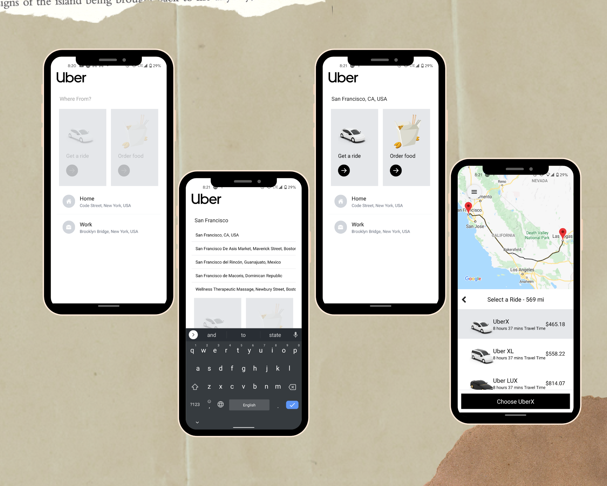

# UBER CLONE

Uber application clone built with React Native, Tailwind CSS, and Redux. React Native Navigation is implemented for seamless navigation between screens and React Native Elements is for an added design. The app utilizes Google Places API, Google Distance Matrix API, and Google Directions API to calculate real travel time, distance, and provide direction navigation.

Screenshot of application:  

Application is hosted on Expo.  To access, please download Expo Go on iOS or Android and open the link provided [on this page](https://expo.dev/@nard1n/uber-clone)

## Table of Contents

* [Installation](#Installation)
* [Usage](#Usage)
* [Contributing](#Contributing)
* [Tests](#Tests)
* [License](#License)
* [Questions](#Questions)

## Installation
Feel free to clone the repo or reference the code and remember to install required packages

## Usage
The purpose of this app build is to practice Mobile Development with React Native

## Contributing
We love seeing community contributions to opensource projects! Did I miss something? Want to make a suggestion? Find a spelling mistake? All messages are greatly appreciated! If you would like to contribute, please do.

## Tests
n/a

## License
This project is released under MIT opensource license:

https://opensource.org/licenses/MIT

## Questions
For more about my work, check out my Github profile: https://github.com/nard1n

If you have any questions and would like to chat, please feel free to send me an email directly to nardin.lachowski@gmail.com
